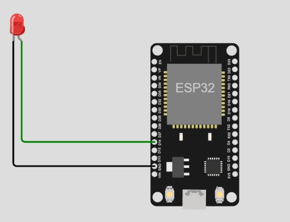
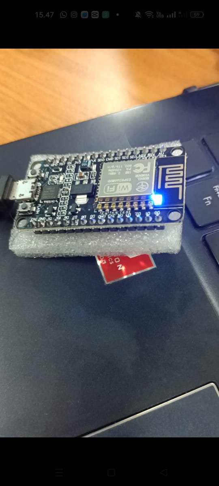

### LAPORAN PRAKTIKUM MINGGU KE 3 <br> 
KELOMPOK 2 : <br> 
1. Aida Millati Mardiana (03)
2. Daffa Aqila R (04)
3. Faiza Kurnia Putri (09) <br>

<br>

1. pada pertemuan kali ini, kelompok kami telah melakukan percobaan instalasi apk arduino dan melakukan konfirgurasi beberapa software lain yang dibutuhkan seperti fritzing. kemudian kelompok kami juga menyalakan lampu LED bawaan node MCU
kode program : 
```void setup() {
  // put your setup code here, to run once:
  pinMode(LED_BUILTIN, OUTPUT);
}

void loop() {
  // put your main code here, to run repeatedly:
  digitalWrite(LED_BUILTIN, HIGH);   // menyalakan LED merah
  delay(1000);                       // menunggu selama 1 detik
  digitalWrite(LED_BUILTIN, LOW);    // mematikan LED merah
  delay(1000);
}
```

2. belum menemukan kendala
3. pada pertemuan kali ini yang bisa disimpulkan adalah kami dapat melakukan instalasi dan konfigurasi software dan hardware pendukung. Bisa melakukan pengoprasian software pendukung(Arduino dan fritzing). kemudian kelompok kami juga menyalakan lampu LED bawaan node MCU
4. JAWABAN TUGAS YANG ADA DI JOBSHEET 
TUGAS 
<br>
    1. Dari aktifitas hari ini, apakah yang telah kelompok Anda lakukan. sebutkan jika terjadi kendala dari aktifitas tersebut <br>
    Jawab : 
    Melakukan instalasi Arduino dan konfigurasi beberapa aplikasi yang dibutuhkan
    2.	Buatlah sebuah skematik sederhana dari salah satu sensor atau aktuator yang telah kelompok Anda beli, boleh menggunakan Fritzing atau Wokwi.
    Jawab : 
    
    3.	Buatlah kode sederhana untuk menyalakan LED merah bawaan node MCU seperti pada gambar di bawah ini <br>
    Jawab : 
    ```void setup() {
    // put your setup code here, to run once:
    pinMode(LED_BUILTIN, OUTPUT);
    }

    void loop() {
    // put your main code here, to run repeatedly:
    digitalWrite(LED_BUILTIN, HIGH);   // menyalakan LED merah
    delay(1000);                       // menunggu selama 1 detik
    digitalWrite(LED_BUILTIN, LOW);    // mematikan LED merah
    }```
<br>


