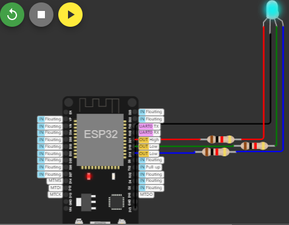
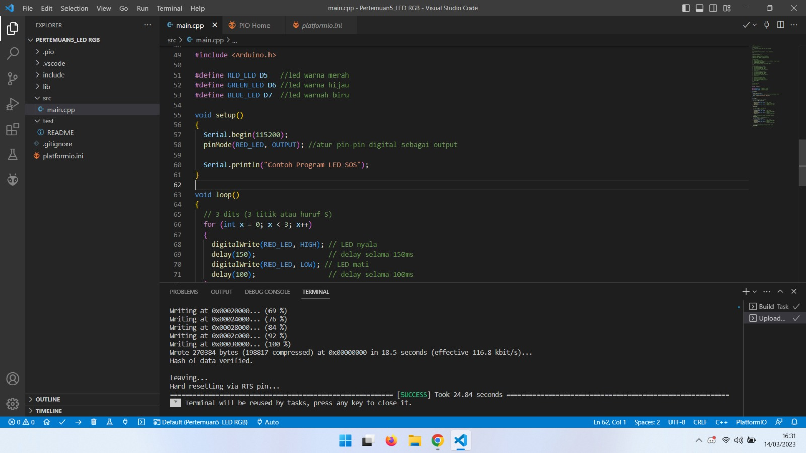

Kelompok 3

Dherisma Hanindita Utami (07)

Dilta Febiana (08)

Meliusa Nora Hariyanti (13)

TI 3G

Kelompok 3
Pertemuan 5
Project 1  : Running LED RGB
1.	Hardware Preparation:

NodeMCU x 1

LED RGB x 1

220 ohm resistor x 3, optional

Kabel Dupont (male to male)

Micro USB cable x 1

PC/laptop x 1

Software Visual Studio Code

 
Project Wokwi

 
https://wokwi.com/projects/305566932847821378 

 
 
## Project 2 : SOS LED
  

 
Laporan Tim

 
Tugas
Menggunakan cara 1A

 
 
Skematik 

Menggunakan SOS

  
 
