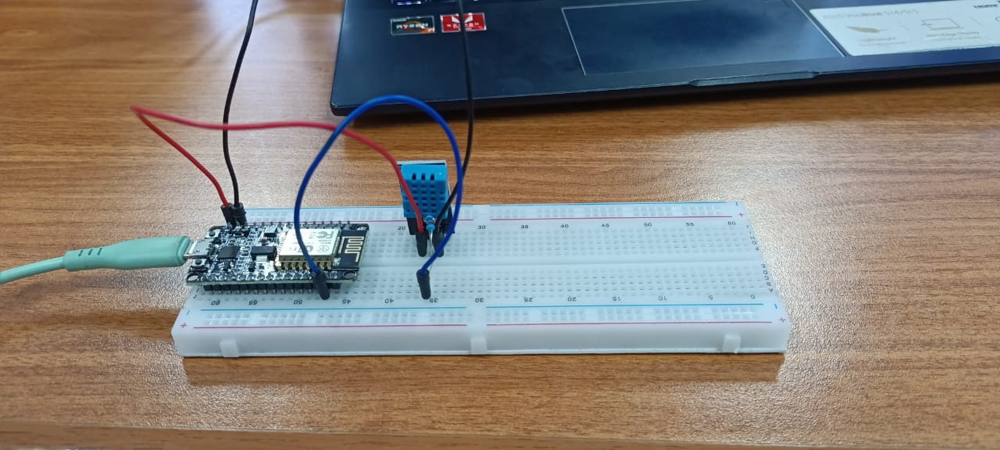
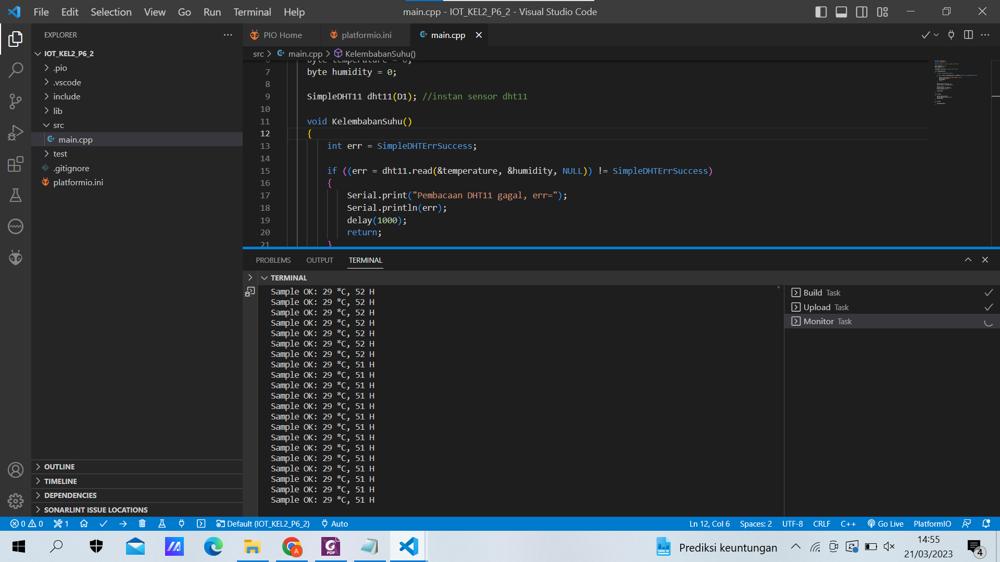

## LAPORAN PRAKTIKUM MINGGU KE 6 <br> 
### KELOMPOK 2 : <br> 
1. Aida Millati Mardiana (03)
2. Daffa Aqila R (04)
3. Faiza Kurnia Putri (09) <br>

### PRAKTIKUM - Project Wokwi 
- Membuat rangkaian seperti berikut : 

- Source code pada wokwi : 
    ``` 
    #include "DHTesp.h"
    const int DHT_PIN = 15; //mendefinisikan pin digital yang digunakan DHT22
    DHTesp dhtSensor; //objek dhtSensor untuk membaca suhu dan kelembaban dari sensor

    void setup() { 
    Serial.begin(115200); dhtSensor.setup(DHT_PIN, DHTesp::DHT22); //inisialisasi sensor DHT22 
    }

    void loop() { 
    TempAndHumidity data = dhtSensor.getTempAndHumidity(); 
    Serial.println("Temp: " + String(data.temperature, 2) + "°C"); 
    Serial.println("Kelembapan: " + String(data.humidity, 1) + "%"); 
    Serial.println("---"); delay(1000); 
    }
    ```
- Output 


### PRAKTIKUM - Membaca data suhu dan kelembaban udara di NodeMCU 
Pada praktikum pertama, anda akan melakukan percobaan untuk menangkap data suhu dan kelembaban udara dengan sensor DHT11 <br>
Susunan rangkaian sederhana pada praktikum ini seperti berikut : <br>

Link repositori source code praktikum : https://github.com/faizakurnia/IOT_KEL2_P6_2.git <br>
Hasil Percobaan : 

### TUGAS 
1. Modifikasi baris kode pada bagian praktikum sehingga muncul data suhu dalam satuan Kelvin dan Reaumur! <br>
Link repositori : https://github.com/AidaMillatiMardiana/Tugas1.git <br>
Hasil : 
2. Buatlah simulasi sebuah alat pembaca suhu dan kelembaban udara di tengah kota dengan memanfaatkan lampu LED sebagai indikator dengan disertai keterangan data suhu dan kelembaban yang ditampilkan pada serial monitor! <br>
Contoh: Suhu pada sebuah kota dikategorikan dingin, normal, dan panas. Masing-masing kategori memiliki indikator lampu LED yang menyala, salah satunya ketika kategori dingin diwakili oleh LED hijau, normal diwakili oleh LED warna Biru, dan panas diwakili oleh LED warna Merah. <br>
Misalkan tidak memiliki LED RGB, silakan menggunakan LED build in NODEMCU. <br>
link repositori : https://github.com/AidaMillatiMardiana/Tugas2.git <br>
hasil : <br>


3. Gambarkan skematik dari simulasi yang Anda buat. <br>

4. Hasil dari simulasi tersebut silakan upload di youtube atau google drive dan urlnya disisipkan pada laporan Anda. <br>
url simulasi : https://drive.google.com/file/d/1mpi8kSSI3v1m1SMwDXz2soTUisLpBx-s/view?usp=share_link 


