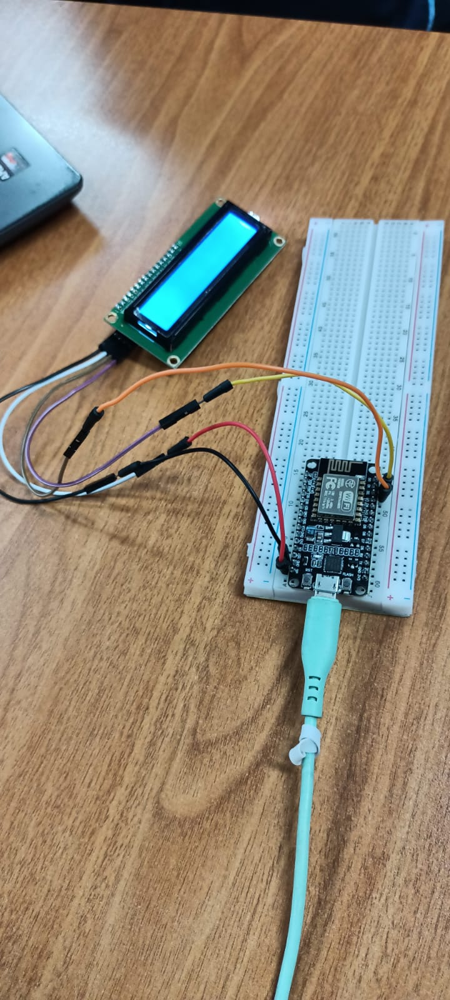
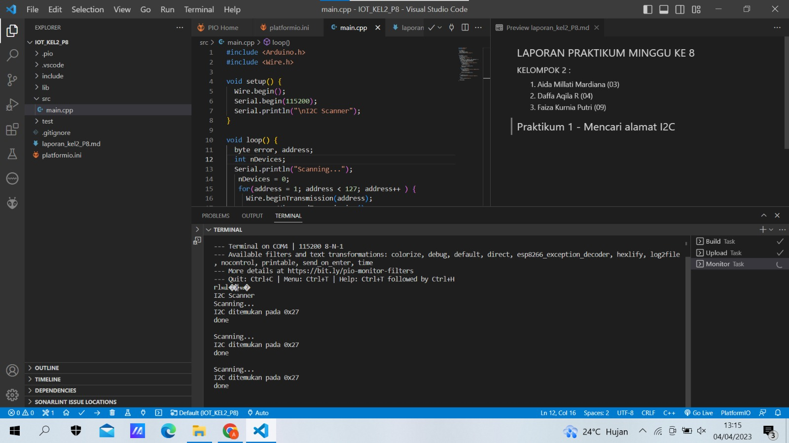
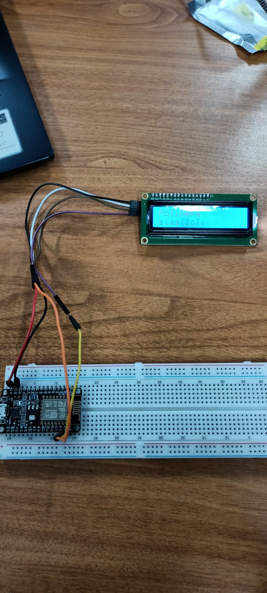
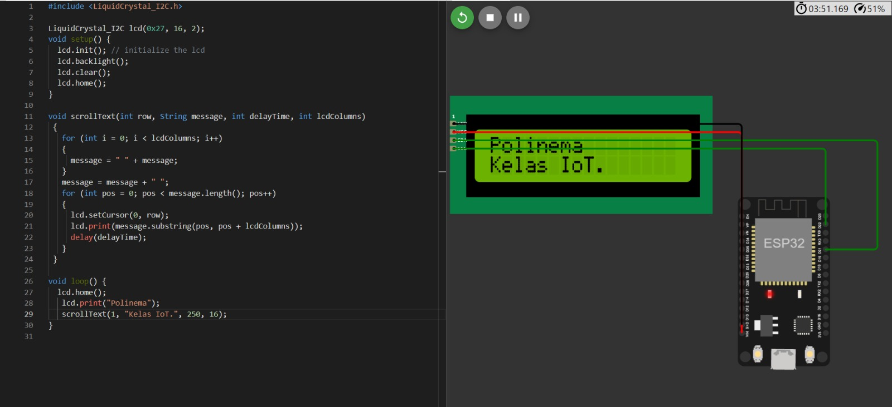
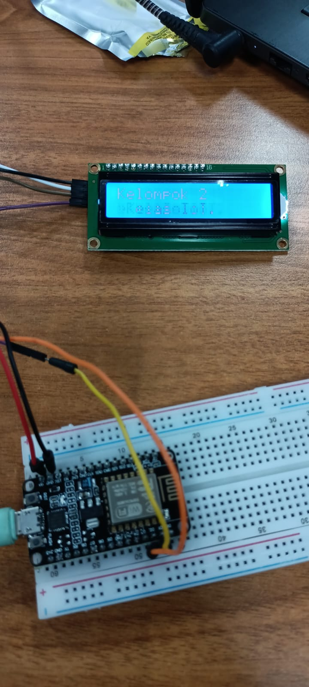
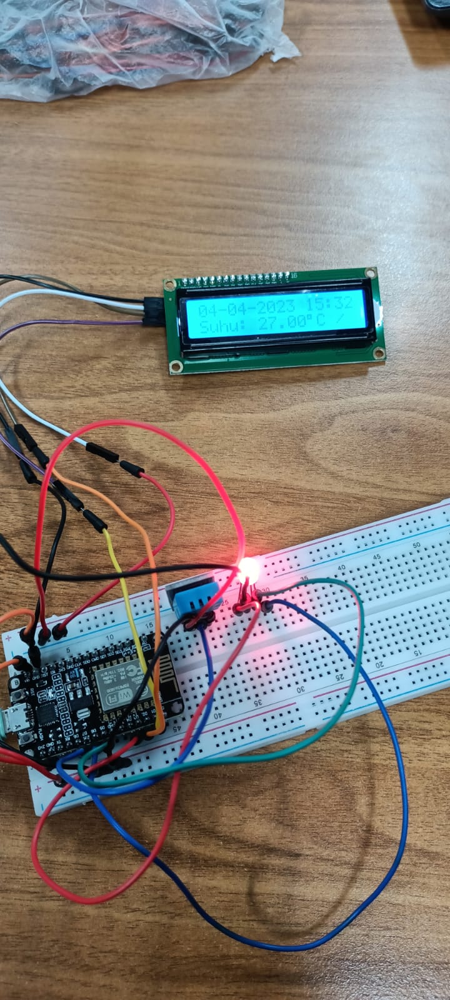

## LAPORAN PRAKTIKUM MINGGU KE 8 <br> 
### KELOMPOK 2 : <br> 
1. Aida Millati Mardiana (03)
2. Daffa Aqila R (04)
3. Faiza Kurnia Putri (09) <br>

## Praktikum 1 - Mencari alamat I2C 
Rangkaian : <br>
Link source code praktikum 1 : https://github.com/AidaMillatiMardiana/IOT_KEL2_P8_Prak1.git <br>
Hasil : <br>

## Praktikum 2 - Menampilkan data pada LCD 
Link source code praktikum 2 : https://github.com/Daffaaq/IoT_Praktikum2.git <br>
Hasil :  <br>
Video Hasil : https://drive.google.com/file/d/15E59o4Mi7lKoXdUFYhnUj1Nl5pe1SyIf/view?usp=share_link 

## Menampilkan data pada LCD wokwi
 <br>

## Pertanyaan (Jawaban)
1. Fungsi dari pemanggilan method ```lcd.backlight()``` adalah untuk menghidupkan atau mematikan backlight (pencahayaan belakang) pada layar LCD. Layar LCD sering digunakan dalam proyek elektronik untuk menampilkan informasi seperti teks atau grafik. Dalam kondisi minim cahaya, backlight memungkinkan teks atau gambar pada layar LCD terlihat lebih jelas dan mudah dibaca
2. Cara mengganti tingkat intensitas kecerahan dari LCD adalah Jika LCD dilengkapi dengan potensiometer atau resistor, kita dapat memutar potensiometer atau mengganti resistor untuk mengatur kecerahan LCD
3. Modifikasi data yang ditampilkan pada LCD, berikut hasil dari modifikasinya : 
 <br>
Video Hasil : 
https://drive.google.com/file/d/1kgEAYXX4g1LlnsAWvMOH8cx9WfYI2bkG/view?usp=share_link 

## Tugas 
Link source code tugas : 
Hasil : 
 <br>
Hasil Video : https://drive.google.com/file/d/1MbZ2knzF5ExYp8WG8Q75Cak-YhTSRxWZ/view?usp=share_link 


