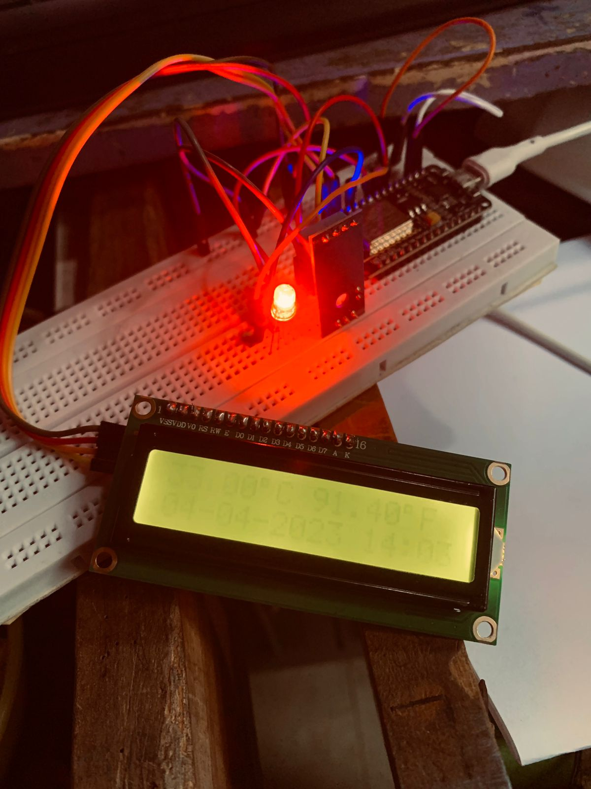

**PERTEMUAN 8**

Nama Kelompok : 
1. Ah Maulidi Rifki MD (01)
2. Dawam Ilhami Assidiqi (05)
3. Hafizh Izhar Darmansyah (11)
4. M. Fairuz Zakaria Firdaus (14)

**Praktikum**<br>

1. Praktikum 1 - Mencari alamat I2C<br>
Kode Program :
```
#include <Wire.h>

 void setup()
 {
 Wire.begin();
 Serial.begin(115200);
 Serial.println("\nI2C Scanner");
 }

void loop() {
  byte error, address;
   int nDevices;
   Serial.println("Scanning...");
   nDevices = 0;
   for(address = 1; address < 127; address++ ) {
     Wire.beginTransmission(address);
     error = Wire.endTransmission();
     if (error == 0) {
       Serial.print("I2C ditemukan pada 0x");
       if (address<16) {
         Serial.print("0");
       }
       Serial.println(address,HEX);
       nDevices++;
     }
     else if (error==4) {
       Serial.print("Unknow error at address 0x");
       if (address<16) {
         Serial.print("0");
       }
       Serial.println(address,HEX);
     }    
   }
   if (nDevices == 0) {
     Serial.println("No I2C devices found\n");
   }
   else {
     Serial.println("done\n");
   }
   delay(3000);
}
```

Hasil :<br>


2. Praktikum 2 - Menampilkan data pada LCD<br>
Kode Program :<br>
```
#include <Arduino.h>
#include <LiquidCrystal_I2C.h>

LiquidCrystal_I2C lcd(0x27, 16, 2);

void setup()
{
  lcd.init(); // initialize the lcd
  lcd.backlight();
  lcd.clear();
  lcd.home();
}

void scrollText(int row, String message, int delayTime, int lcdColumns)
{
  for (int i = 0; i < lcdColumns; i++)
  {
    message = " " + message;
  }
  message = message + " ";
  for (int pos = 0; pos < message.length(); pos++)
  {
    lcd.setCursor(0, row);
    lcd.print(message.substring(pos, pos + lcdColumns));
    delay(delayTime);
  }
}

void loop()
{
  lcd.home();
   lcd.print("Polinema");
   scrollText(1, "Kelas IoT.", 250, 16);
}
```

Hasil :<br>


**Pertanyaan**<br>
1. Jelaskan fungsi dari pemanggilan method lcd.backlight()?<br>
Jawab : Fungsi dari pemanggilan method lcd.backlight() tergantung pada konteks penggunaannya dan library yang digunakan. Namun, secara umum, fungsi tersebut digunakan untuk mengendalikan pencahayaan atau backlight pada sebuah LCD (Liquid Crystal Display).<br>

2. Bagimana caranya mengganti tingkat intensitas kecerahan dari LCD Anda?<br>
Jawab : Memutar bagian LCD contrast menggunakan obeng<br>

3. Silakan modifikasi data yang ditampilkan pada LCD Anda?<br>
Jawab : <br>
Kode Program :
```
#include <Arduino.h>
#include <LiquidCrystal_I2C.h>

LiquidCrystal_I2C lcd(0x27, 16, 2);

void setup()
{
  lcd.init(); // initialize the lcd
  lcd.backlight();
  lcd.clear();
  lcd.home();
}

void scrollText(int row, String message, int delayTime, int lcdColumns)
{
  for (int i = 0; i < lcdColumns; i++)
  {
    message = " " + message;
  }
  message = message + " ";
  for (int pos = 0; pos < message.length(); pos++)
  {
    lcd.setCursor(0, row);
    lcd.print(message.substring(pos, pos + lcdColumns));
    delay(delayTime);
  }
}

void loop()
{
  lcd.home();
  lcd.print("Hai!!!");
  scrollText(1, "Kelompok 6", 250, 16);

  // Meredupkan backlight
  lcd.setBacklight(10); // Setengah dari kecerahan maksimum (255)
}
```

Hasil : <br>
<br>

**TUGAS**<br>

Kode Program :
```
#include <Arduino.h>
#include <LiquidCrystal_I2C.h>
#include <SimpleDHT.h>

LiquidCrystal_I2C lcd(0x27, 16, 2);

#define pinDHT 7 // SD3 pin signal sensor DHT
#define RED D5
#define GREEN D6
#define BLUE D4

byte temperature = 0;
byte humidity = 0;

SimpleDHT11 dht11(D7); // instan sensor dht11

void setup()
{
  Serial.begin(115200);
  pinMode(BLUE, OUTPUT);
  pinMode(RED, OUTPUT);
  pinMode(GREEN, OUTPUT);
  lcd.init(); // initialize the lcd
  lcd.backlight();
  lcd.clear();
  lcd.home();
}

void cekDHT()
{
  // cek DHT11
  int err = SimpleDHTErrSuccess;

  if ((err = dht11.read(&temperature, &humidity, NULL)) != SimpleDHTErrSuccess)
  {
    Serial.print("Pembacaan DHT11 gagal, err=");
    Serial.println(err);
    delay(1000);
    return;
  }
}

void loop()
{

  cekDHT();
  float celsius = (float)temperature;
  float fahrenheit = (celsius * 1.8) + 32;

  lcd.home();

  lcd.print(String(celsius, 2)); // mencetak suhu dengan 2 digit di belakang koma
  lcd.write(byte(0xDF));         // menampilkan simbol derajat dengan karakter ASCII khusus
  lcd.print("C ");
  lcd.print(String(fahrenheit, 2)); // mencetak suhu dalam Fahrenheit
  lcd.write(byte(0xDF));            // menampilkan simbol derajat dengan karakter ASCII khusus
  lcd.print("F");
  lcd.setCursor(0, 1); // set cursor to column 0, row 1
  lcd.print("04-04-2023 14:03");

  // algotitma LED
  // ketika suhu normal 29C
  if (celsius == 30)
  {
    for (int x = 0; x < 3; x++)
    {
      digitalWrite(BLUE, HIGH);
      delay(500);
      digitalWrite(BLUE, LOW);
      delay(500);
    }
  }
  // ketika suhu panas >=30C
  else if (celsius >= 31)
  {
    digitalWrite(RED, HIGH);
    delay(500);
    digitalWrite(RED, LOW);
    delay(500);
  }
  // ketika suhu dingin <=28C
  else if (celsius <= 29)
  {
    digitalWrite(GREEN, HIGH);
    delay(500);
    digitalWrite(GREEN, LOW);
    delay(500);
  }
}
```

Hasil :<br>
<br>