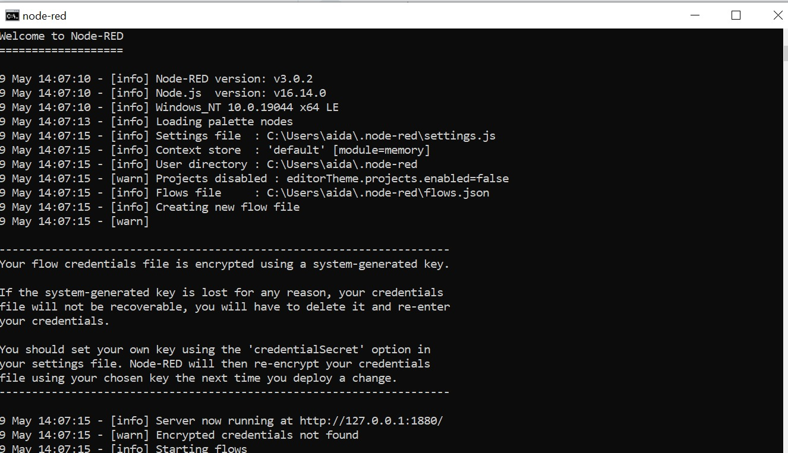

## LAPORAN PRAKTIKUM MINGGU KE 11 <br> 
### KELOMPOK 2 : <br> 
1. Aida Millati Mardiana (03)
2. Daffa Aqila R (04)
3. Faiza Kurnia Putri (09) <br>

## Praktikum Installasi Node-Red
<br>
<br>
Output : 
<br>

## Praktikum Menambahkan Keamanan pada Node-Red 
Edit file setting.js dengan mengganti kode program seperti berikut : 
```     
adminAuth: {
       type: "credentials",
       users: [{
           username: "admin",
           password: "$2a$08$zZWtXTja0fB1pzD4sHCMyOCMYz2Z6dNbM6tl8sJogENOMcxWV9DN.",
           permissions: "*"
       
    },{
        username: "aida",
        password: "$2b$08$P7ZwynITCmulBrWQYMK/Teky0p0oZccYMoNJeOY7K0xcShgjFD00G",
        permissions: "read"
    }]
},
```
Ketika masuk ke Node-RED, akan meminta username dan password seperti berikut : 
<br>

## Pertanyaan 
1. Gantilah port bawaan Node-RED dan buktikan bahwa Node-RED bisa diakses dari public network? <br>
Merubah port menjadi 1234: 
<br>
2. Buktikan dengan tangkapan layar perbedaan antar permisi untuk user read dan full access?
jawab : <br>
permisi user read 
<br>
permisi user full access 
<br>


## Praktikum Sample Node-RED 
1. Drag sebuah pallete node inject pada kategori network ke worksheet, perhatikan gambar berikut ini
<br>
2. Selanjutnya double klik node inject yang terdapat pada worksheet sehingga menampilkan jendela properties seperti berikut
<br>
3. Tambahkan juga node http request pada worksheet, sesuaikan properties pada nilai URL dan name. Isikan URL dengan https://raw.githubusercontent.com/prust/wikipedia-movie-data/master/movies.json dan sedangkan name diisi dengan movie request. Untuk lebih jelasnya dapat dilihat pada gambar berikut ini
<br>
4. Hubungkan node make reqeust (inject) dan movie request (http request) dengan cara klik dan drag antar ujung node, hasilnya dapat dilihat pada gambar berikut ini
<br>
5. Tambahkan node debug yang terdapat pada kategori common, jangan lupa diubah name dengan nama msg. Terakhir hubungkan node tersebut dengan node movie request. Hasil akhirnya adalah sebagai berikut
<br>
<br>
6. Langkah terakhir, silakan klik tombol Deploy yang terletak di pojok kanan atas sampai muncul popup successfully deployed. Jika sudah, klik make request dan amati hasilnya pada bagian debug (klik icon kutu) di jendela sebelah kanan. Untuk lebih jelasnya dapat dilihat pada gambar di bawah ini
<br>

## Pertanyaan 
1. Tambahkan kembali node function dan node debug, yang masing-masing fungsinya adalah untuk memfilter dimana movie yang akan tampil hanya movie dengan tahun > 2000 dan untuk menampilkan data filter tersebut.
<br>
2. Flow dan output pada debug dapat dilihat seperti berikut ini
<br>
<br>

## Tugas 
<br>
<br>


