## LAPORAN PRAKTIKUM MINGGU KE 13   
### KELOMPOK 2 :   
1. Aida Millati Mardiana (03)
2. Daffa Aqila R (04)
3. Faiza Kurnia Putri (09)  

## Praktikum 
1. Install dashboard node Node-RED 
    - muncul jendela User Settings, pilih tab install dan ketik dashboard sehingga akan muncul modul-modul yang bisa kita install dan klik tombol install. Untuk lebih jelasnya perhatikan gambar di bawah ini
    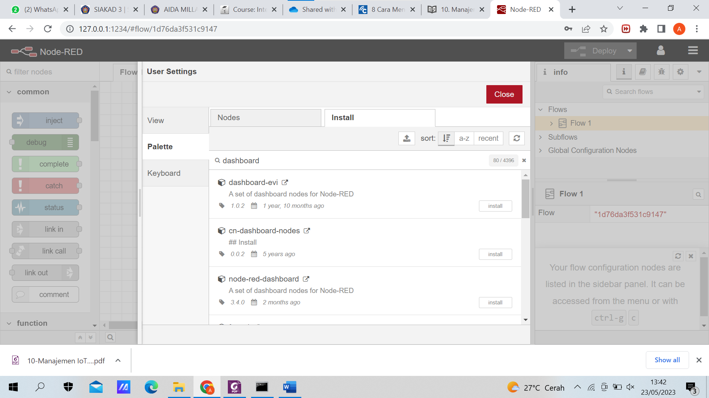 
    - Akan muncul pop notifikasi proses install seperti gambar di bawah ini, silakan pilih atau klik tombol install.
    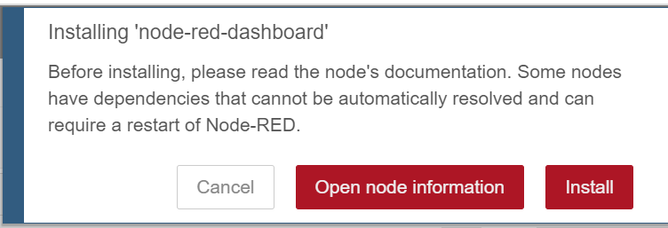 
    - Silakan cek dengan melihat pada Node-RED via browser, seharusnya sudah bertambah komponen-komponen dashboard pada pallete yang terdapat di sebelah kanan
    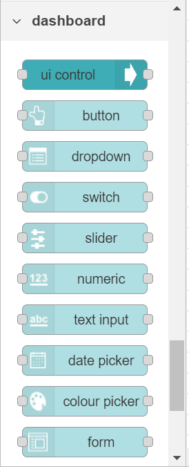 
2. Membuat Dashboard Node-RED
    - Hasil akhir 
    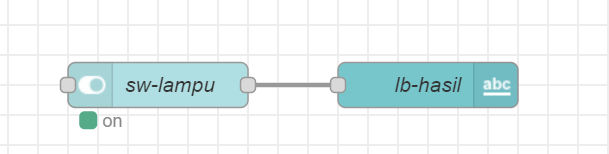 
    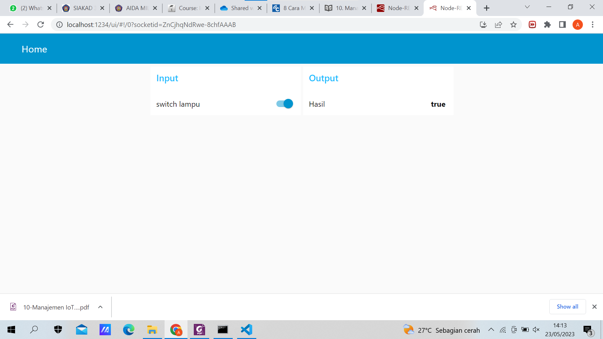 

## Pertanyaan 
Jawab : 
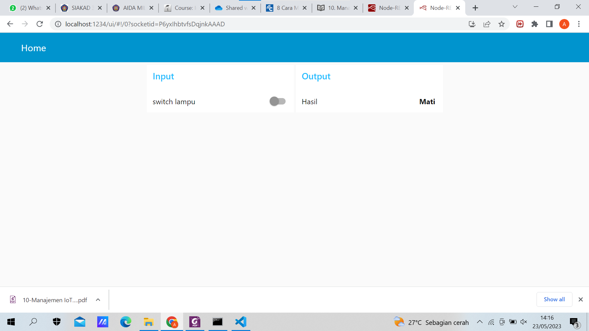 
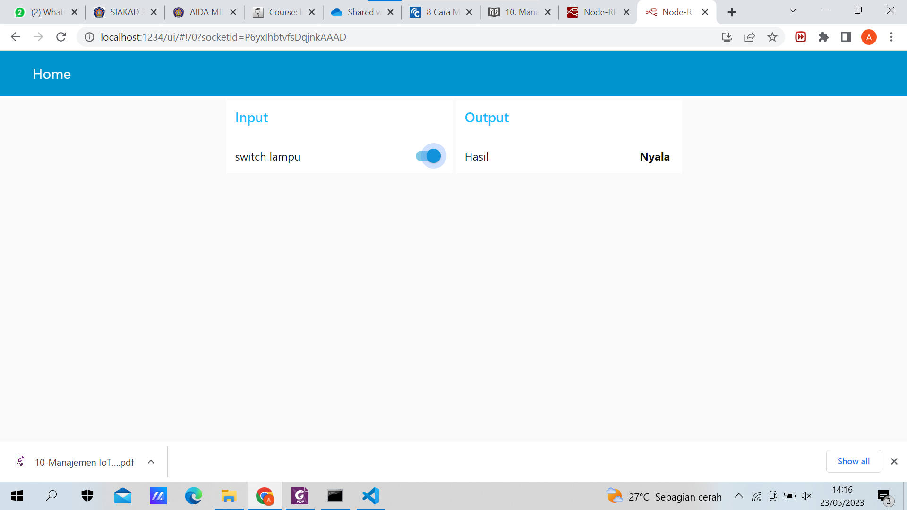 

## Tugas 
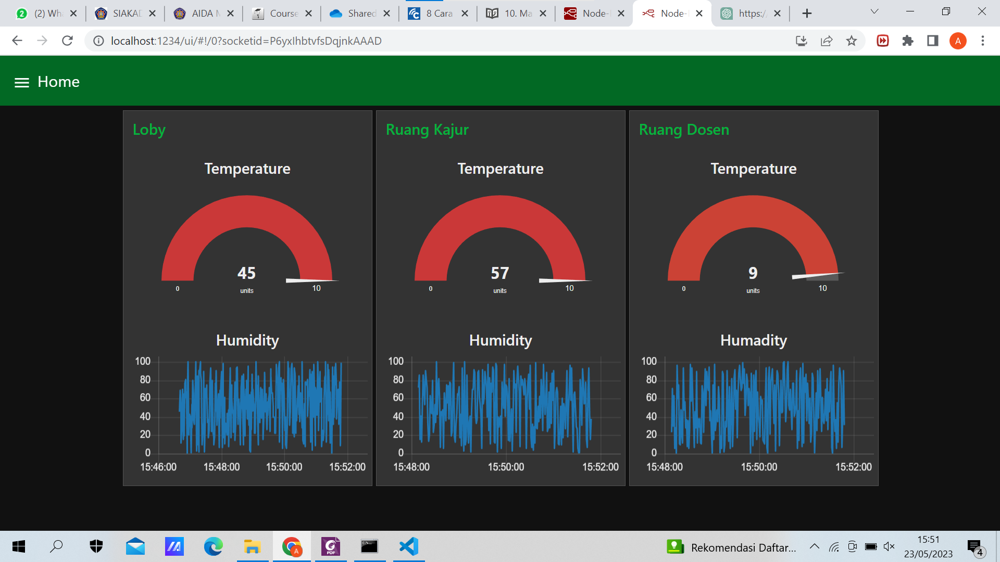 
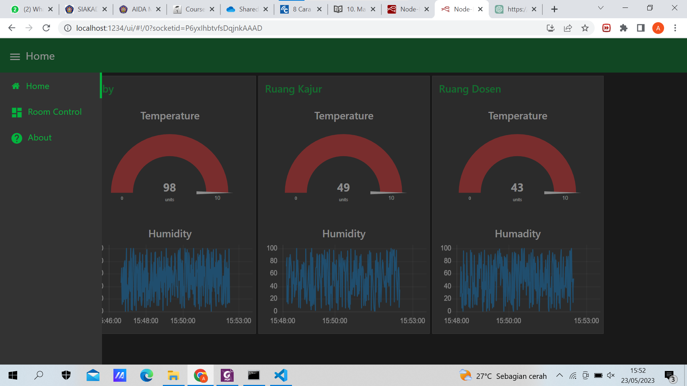 
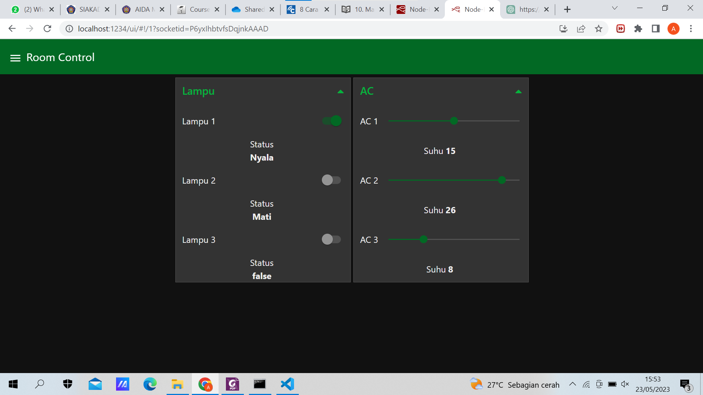 
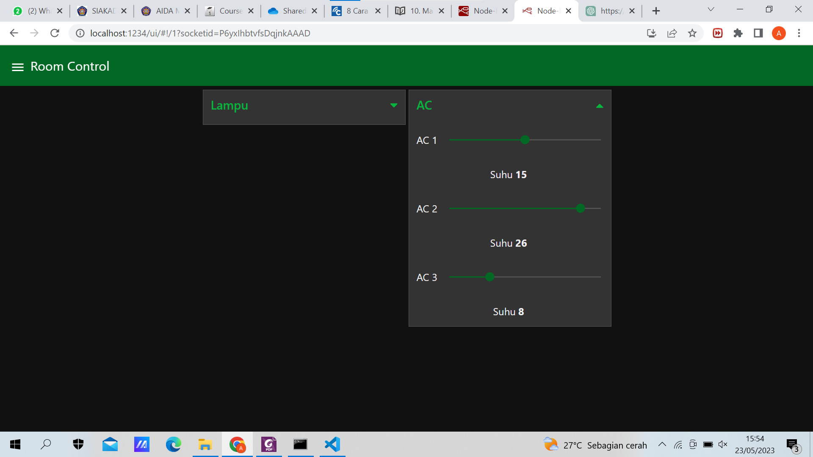 
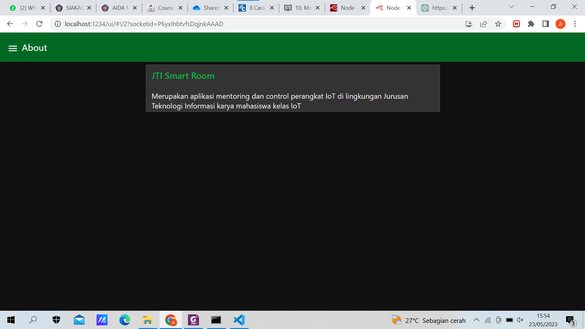 
