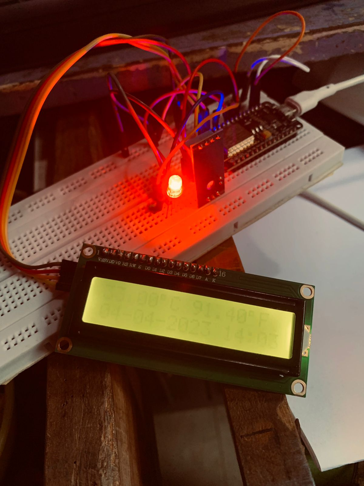

**PERTEMUAN 8**

Nama Kelompok : 
1. Ah Maulidi Rifki MD (01)
2. Dawam Ilhami Assidiqi (05)
3. Hafizh Izhar Darmansyah (11)
4. M. Fairuz Zakaria Firdaus (14)

**Praktikum**<br>

1. Praktikum 1<br>
Kode Program `server.py` :
```c++
import socket
from threading import Thread


# Multithreaded Python server
class ClientThread(Thread):

    def __init__(self, ip, port):
        Thread.__init__(self)
        self.ip = ip
        self.port = port
        print("Incoming connection from " + ip + ":" + str(port))

    def run(self):
        while True:
            try:
                data = conn.recv(2048)
                if len(data) == 0:
                    break
                 # Receive all data until the newline character
                data = b""
                while b"\n" not in data:
                    chunk = conn.recv(2048)
                    if not chunk:
                        break
                    data += chunk
                print("length: " + str(len(data)-2))
                print("Server received data:", data)
                # MESSAGE = input("Input response:")
                MESSAGE = "OK"
                conn.send(MESSAGE.encode("utf8"))  # echo
            except Exception as e:
                print(e)
                break


TCP_IP = "0.0.0.0"
TCP_PORT = 2004
BUFFER_SIZE = 1024

tcpServer = socket.socket(socket.AF_INET, socket.SOCK_STREAM)
tcpServer.setsockopt(socket.SOL_SOCKET, socket.SO_REUSEADDR, 1)
tcpServer.bind((TCP_IP, TCP_PORT))
threads = []

while True:
    tcpServer.listen(4)
    print("Server started on " + TCP_IP + " port " + str(TCP_PORT))
    (conn, (ip, port)) = tcpServer.accept()
    newthread = ClientThread(ip, port)
    newthread.start()
    threads.append(newthread)

for t in threads:
    t.join()
```

Kode Program `main.cpp` :

```c++
#include <Arduino.h>
#include <ESP8266WiFi.h>

#define LED D4

const char *ssid = "Araspot";        // nama SSID untuk koneksi Anda
const char *password = "yondatau";   // password akses point WIFI Anda
const uint16_t port = 2004;          // diganti dengan port serve Anda
const char *host = "192.168.83.101"; // diganti dengan host server Anda, bisa ip ataupun domain

void connect_wifi()
{
  Serial.printf("Connecting to %s ", ssid);
  WiFi.begin(ssid, password);
  while (WiFi.status() != WL_CONNECTED)
  {
    delay(500);
    Serial.print(".");
  }
  Serial.println(" connected");
}

void connect_server()
{
  WiFiClient client;

  Serial.printf("\n[Connecting to %s ... ", host);
  if (client.connect(host, port))
  {
    Serial.println("connected]");

    Serial.println("[Sending a request]");
    client.print("Hai from ESP8266");

    Serial.println("[Response:]");
    String line = client.readStringUntil('\n');
    Serial.println(line);
    client.stop();
    Serial.println("\n[Disconnected]");
  }
  else
  {
    Serial.println("connection failed!]");
    client.stop();
  }
  delay(3000);
}

void setup()
{
  Serial.begin(115200);
  connect_wifi();
}

void loop()
{
  connect_server();
}
```
<br>
2. Praktikum 2<br>
Kode Program `server.py` :

```py
import socket
from threading import Thread
from time import sleep


# Multithreaded Python server
class ClientThread(Thread):

    def __init__(self, ip, port):
        Thread.__init__(self)
        self.ip = ip
        self.port = port
        print("Incoming connection from " + ip + ":" + str(port))

    def run(self):
        while True:
            try:
                MESSAGE = input("Input response:")
                conn.send(MESSAGE.encode("utf8"))  # echo
            except Exception as e:
                print(e)
                break
            sleep(0.25)


TCP_IP = "0.0.0.0"
TCP_PORT = 9001
BUFFER_SIZE = 20

tcpServer = socket.socket(socket.AF_INET, socket.SOCK_STREAM)
tcpServer.setsockopt(socket.SOL_SOCKET, socket.SO_REUSEADDR, 1)
tcpServer.bind((TCP_IP, TCP_PORT))
threads = []

while True:
    tcpServer.listen(4)
    print("Server started on " + TCP_IP + " port " + str(TCP_PORT))
    (conn, (ip, port)) = tcpServer.accept()
    newthread = ClientThread(ip, port)
    newthread.start()
    threads.append(newthread)

for t in threads:
    t.join()

```

Kode Program `main.cpp` :

```c++
#include <Arduino.h>
#include <ESP8266WiFi.h>

const char *ssid = "Tersambung"; // nama SSID untuk koneksi Anda
const char *password = "tanpasandi"; // password akses point WIFI Anda
const uint16_t port = 2004; // diganti dengan port serve Anda
const char *host = "192.168.56.1";//diganti dengan host server Anda, bisa ip ataupun domain

WiFiClient client;

void connect_wifi()
{
  Serial.printf("Connecting to %s ", ssid);
  WiFi.begin(ssid, password);
  while (WiFi.status() != WL_CONNECTED)
  {
    delay(500);
    Serial.print(".");
  }
  Serial.println(" connected");
  delay(250);
}

void connect_server()
{
  while (!client.connect(host, port))
  {
    Serial.printf("\n[Connecting to %s ... ", host);
    delay(1000);
    return;
  }
  Serial.println("connected]");
  delay(1000);
}

void setup()
{
  Serial.begin(115200);
  Serial.println("Contoh penggunaan socket client");
  connect_wifi();
  connect_server();
}

void loop()
{
  if (client.connected())
  {
    Serial.print("[Response:]");
    String line = client.readStringUntil('\n');
    Serial.println(line);
    if (line.equalsIgnoreCase("led-on"))
    {
      pinMode(LED_BUILTIN, HIGH);
      delay(3000);
      pinMode(LED_BUILTIN, LOW);
    }
  }
  else
  {
    connect_server();
  }
  delay(250);
}
```
<br><br>

**TUGAS**<br>
kode program `server.py` :

```py
import socket
from threading import Thread
from time import sleep


# Multithreaded Python server
class ClientThread(Thread):

    def __init__(self, ip, port):
        Thread.__init__(self)
        self.ip = ip
        self.port = port
        # print("Incoming connection from " + ip + ":" + str(port))
        data = conn.recv(2048)
        print("Server received data:", data)

    def run(self):
        while True:
            try:
                MESSAGE = input("Input response:")
                conn.send(MESSAGE.encode("utf8"))  # echo
            except Exception as e:
                print(e)
                break
            sleep(0.25)


TCP_IP = "0.0.0.0"
TCP_PORT = 9001
BUFFER_SIZE = 20

tcpServer = socket.socket(socket.AF_INET, socket.SOCK_STREAM)
tcpServer.setsockopt(socket.SOL_SOCKET, socket.SO_REUSEADDR, 1)
tcpServer.bind((TCP_IP, TCP_PORT))
threads = []

while True:
    tcpServer.listen(4)
    # print("Server started on " + TCP_IP + " port " + str(TCP_PORT))
    (conn, (ip, port)) = tcpServer.accept()
    newthread = ClientThread(ip, port)
    newthread.start()
    threads.append(newthread)

for t in threads:
    t.join()

```

kode program `main.cpp` :

```c++
#include <Arduino.h>
#include <ESP8266WiFi.h>
#include <LiquidCrystal_I2C.h>
#include <SimpleDHT.h>

LiquidCrystal_I2C lcd(0x27, 16, 2);

#define pinDHT 7 // SD3 pin signal sensor DHT

byte temperature = 0;
byte humidity = 0;

SimpleDHT11 dht11(D7); // instan sensor dht11

// LDR
#define sensorLDR A0
int nilaiSensor;

const char *ssid = "Tersambung"; // nama SSID untuk koneksi Anda
const char *password = "tanpasandi"; // password akses point WIFI Anda
const uint16_t port = 2004; // diganti dengan port serve Anda
const char *host = "192.168.56.1";//diganti dengan host server Anda, bisa ip ataupun domain

WiFiClient client;

void connect_wifi()
{
  Serial.printf("Connecting to %s ", ssid);
  WiFi.begin(ssid, password);
  while (WiFi.status() != WL_CONNECTED)
  {
    delay(500);
    Serial.print(".");
  }
  Serial.println(" connected");
  delay(250);
}

void connect_server()
{

  while (!client.connect(host, port))
  {
    Serial.printf("\n[Connecting to %s ... ", host);
    delay(1000);
    return;
  }
  Serial.println("connected]");
  delay(1000);
}

void setup()
{
  Serial.begin(115200);
  lcd.init(); // initialize the lcd
  lcd.backlight();
  lcd.clear();
  lcd.home();

  connect_wifi();
  connect_server();
}

void cekDHT()
{
  // cek DHT11
  int err = SimpleDHTErrSuccess;

  if ((err = dht11.read(&temperature, &humidity, NULL)) != SimpleDHTErrSuccess)
  {
    Serial.print("Pembacaan DHT11 gagal, err=");
    Serial.println(err);
    delay(1000);
    return;
  }
}

void loop()
{
  WiFiClient client;

  cekDHT();
  float celsius = (float)temperature;

  // mengambil data cahaya
  nilaiSensor = analogRead(sensorLDR);

  lcd.home();

  lcd.print("suhu  : ");
  lcd.print(String(celsius, 2)); // mencetak suhu dengan 2 digit di belakang koma
  lcd.write(byte(0xDF));         // menampilkan simbol derajat dengan karakter ASCII khusus
  lcd.print("C ");

  lcd.setCursor(0, 1); // set cursor to column 0, row 1
  lcd.print("cahaya : ");
  lcd.print(String(nilaiSensor)); // mencetak nlai LDR

  String dataServer = "suhu :" + String(celsius) + "C | Cahaya : " + String(nilaiSensor);

  if (client.connect(host, port))
  {
    client.print(dataServer);
    Serial.print("[Response:]");
    String line = client.readStringUntil('\n');
    Serial.println(line);

    int ledState = digitalRead(LED_BUILTIN);

    if (ledState == HIGH && line.equalsIgnoreCase("led-off"))
    {
      pinMode(LED_BUILTIN, LOW);
    }
    else if (ledState == LOW && line.equalsIgnoreCase("led-off"))
    {
      pinMode(LED_BUILTIN, LOW);
    }
    else if (ledState == HIGH && line.equalsIgnoreCase("led-on"))
    {
      pinMode(LED_BUILTIN, HIGH);
    }
    else if (ledState == LOW && line.equalsIgnoreCase("led-on"))
    {
      pinMode(LED_BUILTIN, HIGH);
    }
  }
  else
  {
    connect_server();
  }
  delay(10000);
}
```

Hasil :<br>
