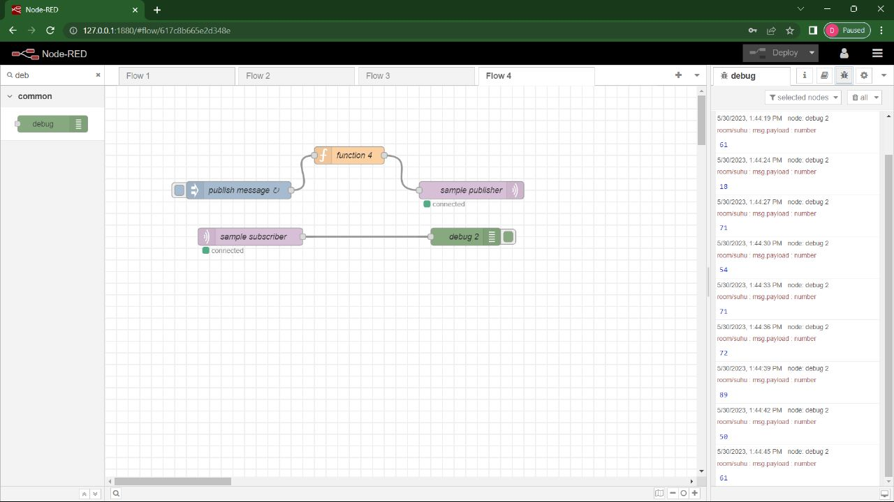
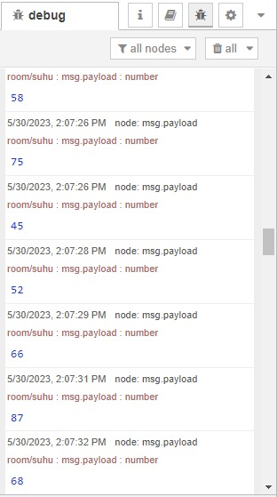
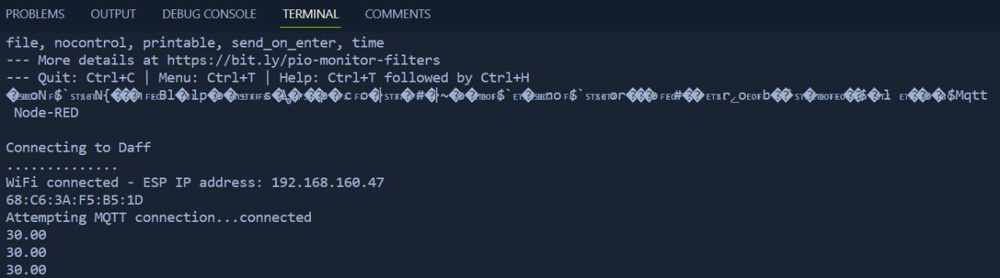
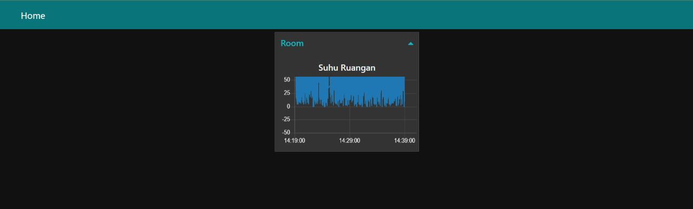
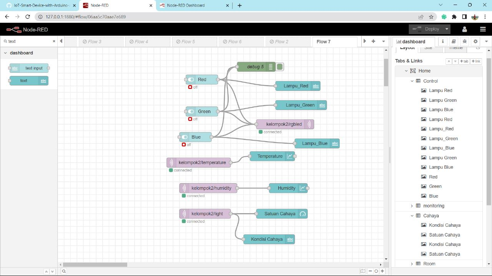
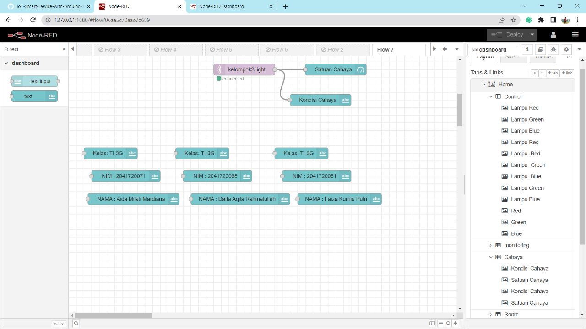
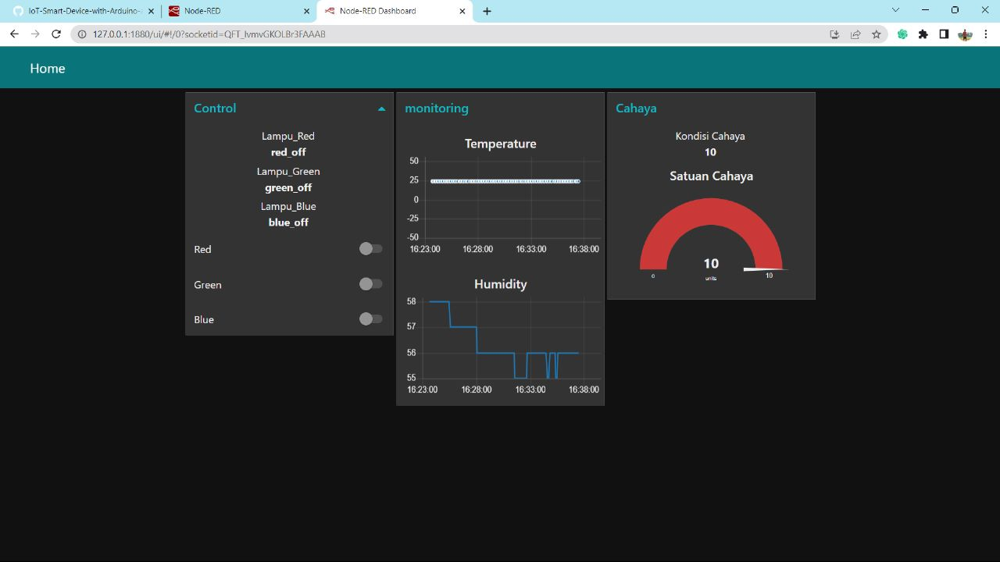
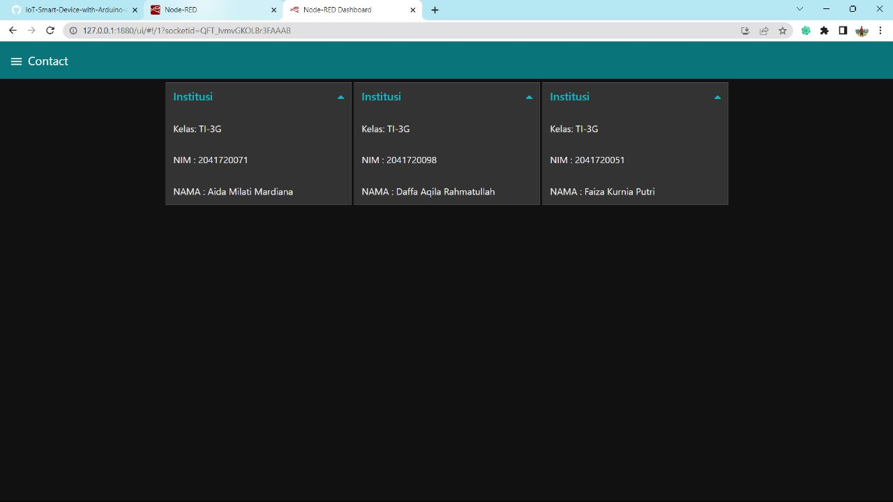

## LAPORAN PRAKTIKUM MINGGU KE 13 <br> 
### KELOMPOK 2 : <br> 
1. Aida Millati Mardiana (03)
2. Daffa Aqila R (04)
3. Faiza Kurnia Putri (09) <br>

#
## PRAKTIKUM 
1. MQTT Node-RED
<br>

## Verifikasi Hasil Percobaan 
    Setelah dilakukan deploy, kemudian klik tab debug atau icon kutu seharusnya adalah sebagai berikut. Adapun untuk nilainya pasti berbeda
    <br>

## Pertanyaan 
    1. Pada node inject, pada properties Repeat dengan nilai interval. Apakah fungsinya?
    Jawab : 
    Pada Node Inject, properti "Repeat" dengan nilai "interval" digunakan untuk mengatur interval waktu antara setiap pengiriman pesan. Jika Anda mengatur nilai interval tertentu (misalnya 5 detik), Node Inject akan secara otomatis mengirimkan pesan setiap 5 detik ke node berikutnya dalam alur aliran (flow) 
    2. Apakah yang dimaksud dengan baris kode msg.payload=Math.floor(Math.random()*100);?
    Jawab : 
    msg.payload=Math.floor(Math.random()*100);?
    Baris kode "msg.payload=Math.floor(Math.random()*100);" berfungsi untuk menghasilkan angka acak antara 0 dan 99 (inklusif) dan menyimpannya dalam properti "payload" pesan (msg). Fungsi Math.random() menghasilkan angka acak antara 0 (inklusif) dan 1 (eksklusif), lalu dikalikan dengan 100 untuk mendapatkan rentang antara 0 dan 100. Fungsi Math.floor() digunakan untuk membulatkan angka tersebut ke bawah menjadi bilangan bulat
    3. Bagian node mqtt out, apakah fungsi Qos dengan nilai 2?
    Jawab : 
    Pada Node MQTT Out, properti "Qos" mengacu pada Quality of Service (QoS) atau tingkat kualitas layanan yang digunakan dalam komunikasi MQTT (Message Queuing Telemetry Transport). Nilai 2 pada properti Qos mengindikasikan bahwa pesan yang dikirim menggunakan QoS level 2. QoS level 2 adalah level tertinggi dalam MQTT dan memberikan jaminan pengiriman pesan paling sedikit satu kali dan dalam urutan yang benar. Hal ini penting dalam aplikasi di mana integritas dan keandalan pesan sangat penting, seperti sistem pengendalian industri atau komunikasi yang kritis

2. Menghubungkan Smart Device Node-RED <br>
    Pada praktikum kali ini akan dibuat sebuah dashboard untuk menampilkan suhu yang dikirimkan oleh ESP-8266 menggunakan protokol MQTT. Langkah awal kita perlu menyiapkan Node-RED selanjutnya kita buat kode di sisi ESP-8266

    ``` 
    #include <Arduino.h>
    #include <ESP8266WiFi.h>
    #include <PubSubClient.h>
    #include <SimpleDHT.h>

    // hp
    const char *ssid = "Daff";
    const char *password = "lengser12";

    // kampus
    // const char *ssid = "Smart Parking";            // sesuaikan dengan username wifi
    // const char *password = "5m4rT_P4rk!Ng";        // sesuaikan dengan password wifi
    const char *mqtt_server = "broker.hivemq.com"; // isikan server broker

    WiFiClient espClient;
    PubSubClient client(espClient);

    SimpleDHT11 dht11(D7);

    long now = millis();
    long lastMeasure = 0;
    String macAddr = "";

    void setup_wifi()
    {
    delay(10);
    Serial.println();
    Serial.print("Connecting to ");
    Serial.println(ssid);
    WiFi.begin(ssid, password);
    while (WiFi.status() != WL_CONNECTED)
    {
        delay(500);
        Serial.print(".");
    }
    Serial.println("");
    Serial.print("WiFi connected - ESP IP address: ");
    Serial.println(WiFi.localIP());
    macAddr = WiFi.macAddress();
    Serial.println(macAddr);
    }

    void reconnect()
    {
    while (!client.connected())
    {
        Serial.print("Attempting MQTT connection...");
        if (client.connect(macAddr.c_str()))
        {
        Serial.println("connected");
        }
        else
        {
        Serial.print("failed, rc=");
        Serial.print(client.state());
        Serial.println(" try again in 5 seconds");
        delay(5000);
        }
    }
    }

    void setup()
    {
    Serial.begin(115200);
    Serial.println("Mqtt Node-RED");
    setup_wifi();
    client.setServer(mqtt_server, 1883);
    }

    void loop()
    {
    if (!client.connected())
    {
        reconnect();
    }
    if (!client.loop())
    {
        client.connect(macAddr.c_str());
    }
    now = millis();
    if (now - lastMeasure > 5000)
    {
        lastMeasure = now;
        int err = SimpleDHTErrSuccess;

        byte temperature = 0;
        byte humidity = 0;
        if ((err = dht11.read(&temperature, &humidity, NULL)) != SimpleDHTErrSuccess)
        {
        Serial.print("Pembacaan DHT11 gagal, err=");
        Serial.println(err);
        delay(1000);
        return;
        }
        static char temperatureTemp[7];
        dtostrf(temperature, 4, 2, temperatureTemp);
        Serial.println(temperatureTemp);

        client.publish("room/suhu", temperatureTemp); // agar lebih unix silakan tambahkan NIM ex: 0001/room/suhu
    }
    }
    ```

## Verifikasi Hasil Percobaan 
<br>
Tampilan serial monitor 
<br>
Tampilan Node-RED pada browser 


## TUGAS 
<br>
<br>
LINK VIDEO PERCOBAAN
https://drive.google.com/file/d/1TM0C65bhpTylqPmcsxq4MYN4oi50SUPl/view?usp=sharing 
<br>
<br>


