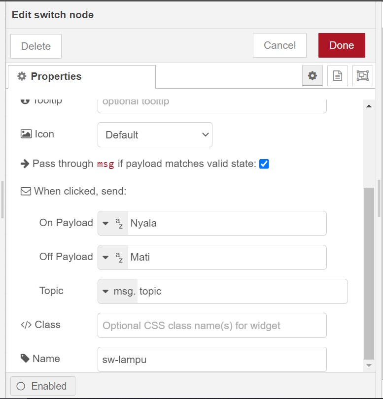
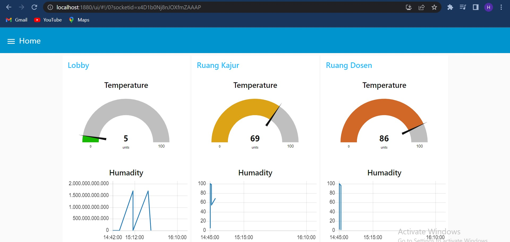
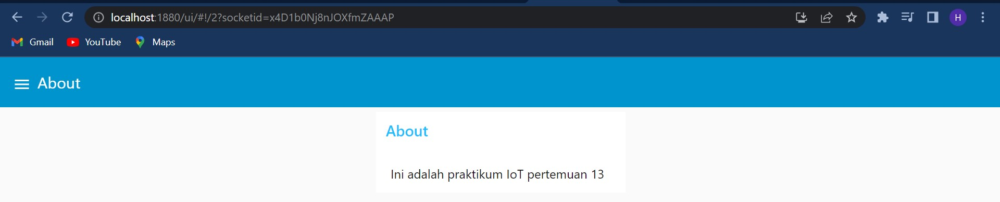

**PERTEMUAN 13**

Nama Kelompok :  
1. Ah Maulidi Rifki MD (01)
2. Dawam Ilhami Assidiqi (05)
3. Hafizh Izhar Darmansyah (11)
4. M. Fairuz Zakaria Firdaus (14)

**Praktikum** 

1. Install Dashboard Node-RED 

2. Membuat Dashboard Node-RED 
Hasil Dashboard 
 
Tampilan Dashboard 
 

3. Memoodifikasi flow di atas sehingga ketika node switch digeser tidak menghasilkan nilai true atau false, tetapi ketika digeser nilainya adalah nyala atau mati. 

Mengubahnya dengan cara mengubah format dari True/False menjadi string Mati/Nyala: 
 

Dalam keadaan mati :  
 

Dalam keadaan nyala :  
 

4. Tugas 
Buatlah sebuah dashboard website untuk memonitoring dan control pada sebuah ruang lobby, ruang kajur, dan ruang dosen. 

Skema Tugas : 
Dashboard Home 
 

Dashboard Room Control 
 

Dashboard About 
 

Hasil Tugas :  
Dashboard Home 
 

Dashboard Room Control 
 

Dashboard About 
