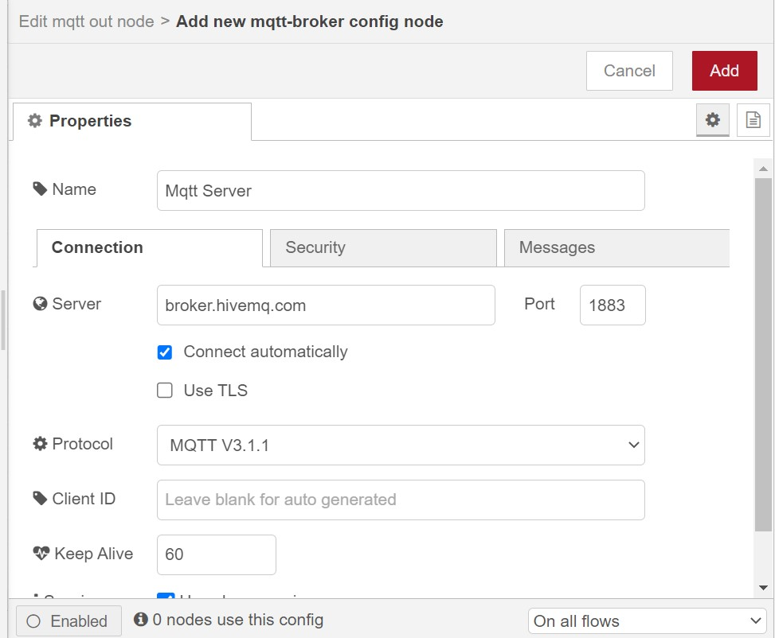

**PERTEMUAN 14**

Nama Kelompok : 
1. Ah Maulidi Rifki MD (01)
2. Dawam Ilhami Assidiqi (05)
3. Hafizh Izhar Darmansyah (11)
4. M. Fairuz Zakaria Firdaus (14)

**Praktikum**`

**A. MQTT Node-RED** 
Walaupun beberapa protokol yang dapat disupport oleh Node-RED, akan tetapi pada kesempatan kali ini protokol yang digunakan MQTT. Untuk menggunakan protokol MQTT, pada Node-RED dashboard ketika melakukan installasi sudah termasuk di dalamnya. Ikut langkah-langkah di bawah ini untuk mulai praktikum 

1. Silakan seret node inject ke worksheet, kemudian ubahlah nilai properties seperti pada gambar berikut :  
 

2. Seret juga node function ke worksheet, sesuaikan propertiesnya seperti pada gambar berikut :  
 

3. Jangan lupa seret juga node mqtt out pada kategori network, tambahkan server broker agar bisa publish data dengan cara klik icon pensil. Konfigurasinya adalah sebagai berikut adalah sebagai berikut : 
 
 

Gambar berikut untuk flow lengkapnya, setelah semua node dihubungkan : 
 

4. Tambahkan node mqtt in ke worksheet, sesuaikan konfigurasi sebagai berikut : 
 

5. Tambahkan node terakhir yaitu node debug, sementara untuk kongifigurasinya tidak perlu disesuaikan. Hubungkan kedua node tersebut sehingga menjadi sebagai berikut : 
 

Sehingga flow lengkap dari langkah awal sampai akhir adalah sebagai berikut
 

**Verifikasi Hasil Percobaan Praktikum 1 MQTT Node-RED** 
 

**Pertanyaan** 
1. Pada node inject, pada properties Repeat dengan nilai interval. Apakah fungsinya? 
Jawab : Digunakan untuk mengatur interval pengulangan injeksi. Dengan mengatur nilai properti "Repeat" menjadi "interval" dan mengisi nilai interval yang diinginkan, Node Inject akan secara otomatis mengirimkan payload ke alur Node-RED pada interval yang ditentukan. 

2. Apakah yang dimaksud dengan baris kode msg.payload=Math.floor(Math.random()*100);? 
Jawab : Digunakan untuk menghasilkan nilai acak antara 0 hingga 99 dan menyimpannya ke dalam properti payload dari objek pesan (msg). 
- Math.random() adalah fungsi JavaScript yang mengembalikan nilai acak antara 0 hingga 1 (dalam bentuk desimal). 
- Math.random() * 100 menghasilkan nilai acak antara 0 hingga 99.9999... (dalam bentuk desimal). 
- Math.floor() adalah fungsi JavaScript yang membulatkan nilai ke bawah ke bilangan bulat terdekat.  Dalam kasus ini, Math.floor(Math.random() * 100) membulatkan nilai acak tersebut menjadi bilangan bulat antara 0 hingga 99. 
- msg.payload = Math.floor(Math.random() * 100); mengassign nilai acak tersebut ke properti payload dari objek pesan (msg), sehingga nilai acak tersebut dapat digunakan atau dikirim ke node lain dalam alur Node-RED. 

3. Bagian node mqtt out, apakah fungsi Qos dengan nilai 2? 
Jawab : Nilai 2 pada QoS dalam Node MQTT Out mengindikasikan QoS tingkat 2. Tingkat QoS 2 adalah tingkat tertinggi dalam MQTT dan memberikan jaminan bahwa pesan akan dikirimkan tepat sekali dan diterima hanya sekali oleh penerima. 

**B. Menghubungkan Smart Device Node-RED** 

1. Silakan buat flow baru dengan cara klik tombol plus(+), tambahkan terlebih dahulu node mqtt in ke worksheet dengan konfigurasi sebagai berikut : 
 

2. Buatlah dashboard dengan tab Site dengan title Node-RED Dashboard dengan layout adalah sebagai berikut : 
 

3. Tambahkan node chart dan sesuaikan konfigurasinya menjadi sebagai berikut :  
 

**Verifikasi Hasil Percobaan Praktikum 2 Menghubungkan Smart Device Node-RED** 

**Pertanyaan** 

1. Modifikasi program di ESP8266 di atas agar bisa melakukan subscribe dengan topik room/lamp? 
Jawab :  

2. Tambahkan kode di atas agar bisa publish nilai kelembaban dengan topik room/humadity? 
Jawab :  

3. Tambah node chart agar dapat menampilkan nilai kelembaban, node chart masih dalam satu group yaitu Room pada dashboard Node-RED. 
Jawab :  

**TUGAS**
